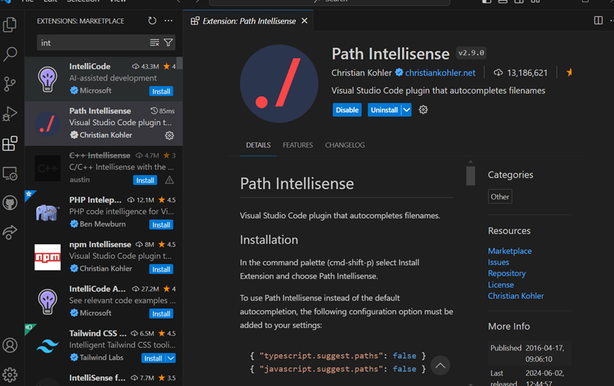

# Dev_Setup
Setup Development Environment

#Assignment: Setting Up Your Developer Environment

#Objective:
This assignment aims to familiarize you with the tools and configurations necessary to set up an efficient developer environment for software engineering projects. Completing this assignment will give you the skills required to set up a robust and productive workspace conducive to coding, debugging, version control, and collaboration.

#Tasks:

1. Select Your Operating System (OS):
   Choose an operating system that best suits your preferences and project requirements. Download and Install Windows 11. https://www.microsoft.com/software-download/windows11

Procedure includes;

1.	Check System Requirements:
Ensure your device meets Windows 11 requirements (1 GHz CPU, 4 GB RAM, 64 GB storage, UEFI, TPM 2.0, DirectX 12 compatible graphics, HD display).

2.	Backup Data:
Backup important data to an external drive or cloud storage.

3.	Download Windows 11:

Visit Windows 11 Download.
Select download option: Installation Assistant, Media Creation Tool, or ISO file.

4.	Create Installation Media:
If needed, use the Media Creation Tool to create a bootable USB or DVD.

5.	Install Windows 11:
Insert installation media and restart PC, boot from the media.
Follow on-screen instructions: select language, time, keyboard, click “Install Now”, enter product key, choose installation type, complete prompts.

6.	Set Up Windows 11:

Complete setup instructions, connect to the internet, sign in with a Microsoft account, set preferences.
7.	Install Updates and Drivers:

Check for and install updates and necessary drivers.

8.	Restore Data and Install Software:

Restore backed-up data and install required software and tools.

2. Install a Text Editor or Integrated Development Environment (IDE):
   Select and install a text editor or IDE suitable for your programming languages and workflow. Download and Install Visual Studio Code. https://code.visualstudio.com/Download

1.	Identify Needs:

Determine the primary programming languages you will be using.
Evaluate Features:

Look for syntax highlighting, code completion, debugging tools, and extensions.

2.	Consider Performance:

Ensure it runs smoothly on your hardware and is user-friendly.

3.	Check Support:

Look for good community support, regular updates, and documentation.

4.	Assess Integration:

Ensure compatibility with other tools and frameworks in your workflow.
Downloading and Installing Visual Studio Code on Windows

5.	Download Visual Studio Code:

Visit Visual Studio Code Download.
Select the Windows download option.

6.	Install Visual Studio Code:

Run the downloaded .exe file.
Follow the setup wizard instructions.
Choose installation options and click "Install."

7.	Launch Visual Studio Code:

Open Visual Studio Code from the Start menu or desktop icon.

8.	Install Extensions:

Click the Extensions icon or press Ctrl+Shift+X.
Search for and install relevant extensions for your programming languages and workflow.

9.	Configure Settings:

Go to File > Preferences > Settings or press Ctrl+, to customize settings.

10.	Set Up Version Control:

Use the built-in Git support to initialize or clone a repository.
Access the Source Control view by clicking the Source Control icon.

3. Set Up Version Control System:
   Install Git and configure it on your local machine. Create a GitHub account for hosting your repositories. Initialize a Git repository for your project and make your first commit. https://github.com

Step 1: Install Git
1.	Download and Install Git:
Visit Git Downloads and download the Windows version.
Run the installer with default settings.
2.	Verify Installation:
Open Git Bash and type git --version.

Step 2: Configure Git
1.	Open Git Bash:
From the Start menu, open Git Bash.
2.	Set Username and Email:
git config --global user.name "pjmcorimbo"
git config --global user.email felixtimothy254@gmail.com

Step 3: Create a GitHub Account
1.	Sign Up:
Visit GitHub and sign up for an account.

Step 4: Initialize a Git Repository
1.	Create Project Folder:
Create a folder for your project.
2.	Initialize Repository:
Open Git Bash, navigate to the project folder (cd path/to/your/project), and run git init.

Step 5: Make Your First Commit
1.	Add Files:
Add files to your project folder.
Run git add . in Git Bash.
2.	Commit Files:
Run git commit -m "Initial commit".

Step 6: Push to GitHub
1.	Create a GitHub Repository:
On GitHub, click the "+" icon and select "New repository."
Enter repository details and create it.
2.	Connect and Push:
In Git Bash, run git remote add origin https://github.com/yourusername/your-repo-name.git.
Push your commits with git push -u origin master.

4. Install Necessary Programming Languages and Runtimes:
  Instal Python from http://wwww.python.org programming language required for your project and install their respective compilers, interpreters, or runtimes. Ensure you have the necessary tools to build and execute your code.

Step 1: Install Python
1.	Download Python:
Go to Python's download page.
Download the latest installer for Windows.
2.	Run the Installer:
Open the downloaded .exe file.
Check "Add Python to PATH."
Click "Install Now."
3.	Verify Installation:
Open Command Prompt.
Type python --version and pip --version.

Step 2: Install Necessary Tools
1.	Install an IDE or Text Editor:
Download and install Visual Studio Code from VS Code Download.
2.	Install Python Packages:
Open Command Prompt.
Use pip to install packages (e.g., pip install numpy, pip install pandas).
3.	Install Compilers (if needed):
For C/C++, download and install GCC from Mingw-w64.

Step 3: Set Up Development Environment
1.	Set Up IDE:
Open Visual Studio Code.
Install the Python extension from the Extensions view.
2.	Create Virtual Environment:
Open Command Prompt in your project directory.
Run python -m venv env.
Activate the environment: env\Scripts\activate.
3.	Install Project Dependencies:
With the environment activated, run pip install -r requirements.txt (if applicable).

Step 4: Test Your Setup
1.	Create a Sample Script:
Create test.py with print("Hello, World!").
2.	Run the Script:
Navigate to the script's directory in Command Prompt or terminal.
Run python test.py and verify it prints "Hello, World!".

5. Install Package Managers:
   If applicable, install package managers like pip (Python).

Step 1: Install pip
1.	Download get-pip.py:
Visit get-pip.py and save the file.
2.	Run get-pip.py:
Open Command Prompt, navigate to the file location.
Execute python get-pip.py.
3.	Verify Installation:
Type pip --version to confirm pip is installed.

Step 2: Use pip for Installing Packages
1.	Install Packages:
Install packages with pip install package_name.
2.	Upgrade pip (Optional):
Upgrade pip with pip install --upgrade pip.
3.	Manage Packages:
List installed packages: pip list.
Uninstall a package: pip uninstall package_name.

6. Configure a Database (MySQL):
   Download and install MySQL database. https://dev.mysql.com/downloads/windows/installer/5.7.html

Step 1: Download MySQL Installer
Visit the MySQL Downloads page: MySQL Installer 5.7.
Download: Select the appropriate MSI installer (32-bit or 64-bit) and click the download link. Skip sign-up if prompted by selecting "No thanks, just start my download".

Step 2: Install MySQL
Run the Installer: Locate and double-click the downloaded file.
Choose Setup Type: Select from Developer Default, Server Only, Client Only, Full, or Custom, then click Next.
Check Requirements: Install any missing dependencies if prompted, then click Next.
Install: Click Execute to start the installation. Click Next when done.

Step 3: Configure MySQL
Product Configuration: Click Next to begin.
Type and Networking: Choose the configuration type and set the port (default 3306). Click Next.
Authentication Method: Select the recommended encryption method.
Accounts and Roles: Set the root password and optionally create additional users. Click Next.
Windows Service: Configure MySQL to run as a Windows Service. Click Next.
Apply Configuration: Click Execute, then Finish when done.

Step 4: Verify Installation
Command Prompt: Open cmd and type mysql -u root -p, then enter your root password.
Success Check: If you see the MySQL prompt (mysql>), the installation is successful.

Step 5: Optional Tools
MySQL Workbench: If installed, open it and connect using root credentials.
MySQL Shell: Open from the Start menu and connect to your server.

7. Set Up Development Environments and Virtualization (Optional):
   Consider using virtualization tools like Docker or virtual machines to isolate project dependencies and ensure consistent environments across different machines.

Option 1: Using Docker
1.	Install Docker Desktop:
Download from Docker Desktop for Windows.
Run the installer and follow instructions.
2.	Set Up a Dockerized Environment:
Build and run the Docker container:
Access your app at http://localhost:5000.

Option 2: Using Virtual Machines
1.	Install Virtualization Software:
Download and install VirtualBox.
Download and install Vagrant.
2.	Set Up a Vagrant VM:
Create a Vagrantfile in your project directory:
Start and SSH into the VM:
Run your application inside the VM:
Access your app at http://localhost:5000.

This setup ensures isolated and consistent development environments using Docker or VMs.

8. Explore Extensions and Plugins:
   Explore available extensions, plugins, and add-ons for your chosen text editor or IDE to enhance functionality, such as syntax highlighting, linting, code formatting, and version control integration.

9. Document Your Setup:
    Create a comprehensive document outlining the steps you've taken to set up your developer environment. Include any configurations, customizations, or troubleshooting steps encountered during the process. 

#Deliverables:
- Document detailing the setup process with step-by-step instructions and screenshots where necessary.
- A GitHub repository containing a sample project initialized with Git and any necessary configuration files (e.g., .gitignore).

https://github.com/pjmcorimbo/test_on_assng2.git

- A reflection on the challenges faced during setup and strategies employed to overcome them.

Challenge
New users often find Git commands and concepts like staging, committing, and pushing confusing.
Issues with installing Git or configuring user information (name and email) correctly.
Issues with initializing a repository, creating a README, or setting up .gitignore files.
Issues with SSH keys or HTTPS authentication leading to problems pushing and pulling changes

Mitigation
Practice: Regularly practice Git commands in a sandbox environment or with personal projects to build familiarity.
Step-by-Step Guides: Use detailed step-by-step tutorials available online to ensure all steps are followed correctly.
Use GitHub’s web interface to initialize the repository with a README and .gitignore file.
Credential Managers: Use credential managers like Git Credential Manager (GCM) to handle credentials securely.

#Submission:
Submit your document and GitHub repository link through the designated platform or email to the instructor by the specified deadline.

#Evaluation Criteria:**
- Completeness and accuracy of setup documentation.
- Effectiveness of version control implementation.
- Appropriateness of tools selected for the project requirements.
- Clarity of reflection on challenges and solutions encountered.
- Adherence to submission guidelines and deadlines.

Note: Feel free to reach out for clarification or assistance with any aspect of the assignment.
